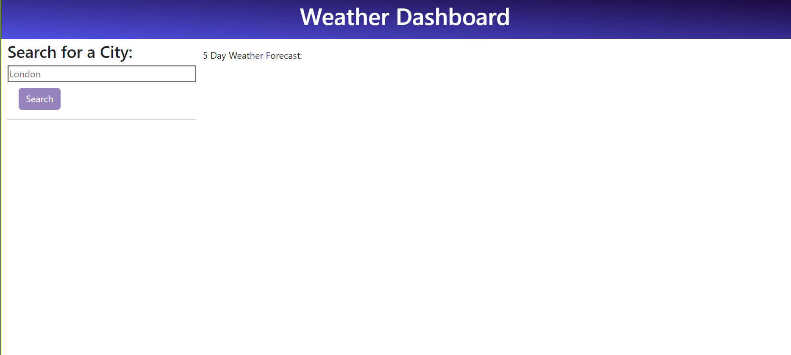
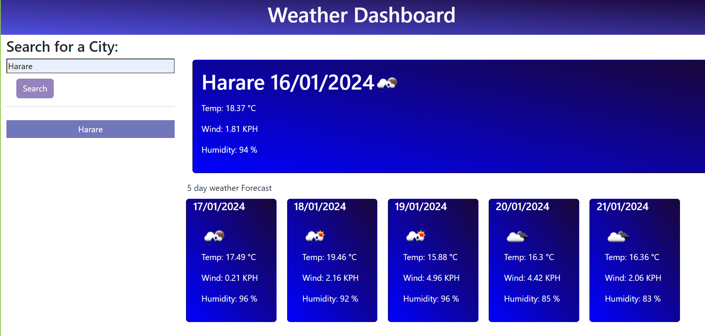
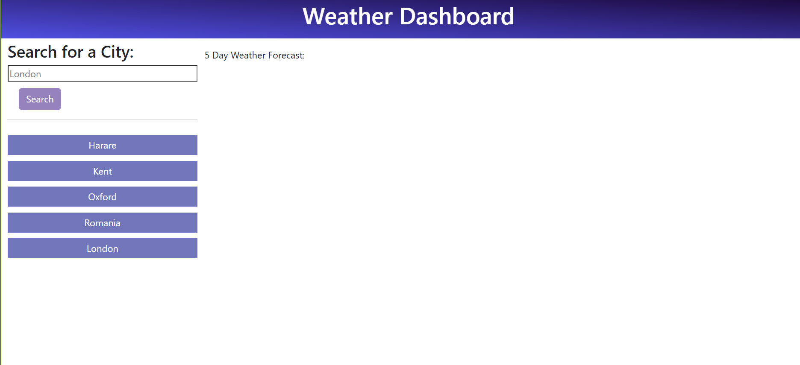
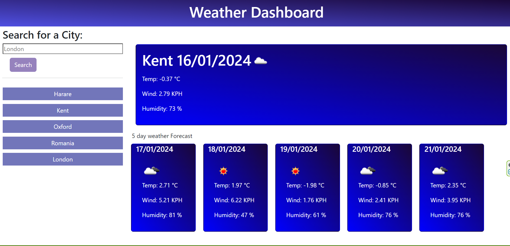

# weather-dashboard

# Description
This is a a dashboard that displays the weather for a given city over a 5 day period. the dashboard display's current / today's weather in the bigsection and future weather is shown at the bottom. This data is being collected from a weather API.

The content is dynamically updated and uses geographical coordinates. When the user searches for a city using form input, they are presented with the current and future conditions for that city, and the city is added to the search history.

## How it works

When a user views the **current** weather conditions for their chosen city, they will see:

- **City name**
- **Date**
- **Icon representation of weather conditions**
- **Temperature**
- **Wind speed**
- **Humidity**

When a user views the **future** weather conditions for their chosen city, they will see:

- **Date**
- **Icon representation of weather conditions**
- **Temperature**
- **Wind speed**
- **Humidity**

When a user clicks on a city in the search history, they will again see the current and future conditions for the city.

## Try it for yourself

View the deployed weather dashboard here: https://eampofu.github.io/weather-dashboard
# Screenshots

## start 

## after a single search

## search History

## searched weather

## License

MIT. Please see original GitHub repository.